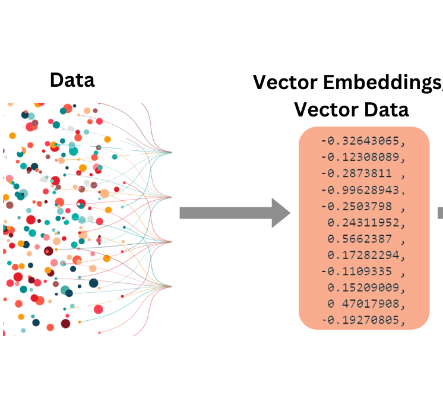

# 🤖 Sigma-AI – GenAI-Powered Integrated Platform Environment


**Sigma-AI** is a GenAI-enabled Integrated Platform Environment (IPE) application that empowers platform engineering teams by combining multiple tool capabilities into a **single intelligent interface**. It reduces context switching, streamlines operations, and introduces **Agentic AI capabilities** like:

- 🔁 Contextual understanding of incidents and system data  
- 💡 Intelligent recommendations based on historical and real-time context  
- 🧠 Root cause analysis using LLMs  
- ✍️ Automated description reframing for better incident clarity  
- 🔍 Extraction of key data points and correlations from change logs, incident history, and trace logs  

---

## 🧠 How It Works

<p align="center">
  
</p>


1. **Raw data** (incidents, descriptions, etc.) is embedded into high-dimensional vectors.  
2. FAISS is used for **vector similarity search**.  
3. A connected **LLM generates RCA summaries** from top matching incidents.  
4. Relevant **Change Requests and logs** are correlated automatically.  

---

## 🚀 Features

- 🔍 **Semantic Incident Search**  
- 📊 **Top Matching Incidents**  
- 🧠 **AI-Powered RCA Generation**  
- 🔁 **Change Request Correlation**  
- 📄 **Log Trace Lookup**  

---

## 📂 Project Structure

```
.
├── streamlit_app.py
├── app/
│   ├── data_loader.py
│   ├── vector_search.py
│   ├── model_runner.py
│   ├── change_checker.py
│   └── log_checker.py
├── data/
│   ├── incident_data.csv
│   ├── change.csv
│   ├── CMDB_Mapping.csv
│   └── Logs_Lookup.csv
└── requirements.txt
```

---

## 🛠️ Installation

```bash
git clone https://github.com/your-username/sigma-ai.git
cd sigma-ai
pip install -r requirements.txt
streamlit run streamlit_app.py
```

---

## 🤖 LLM Setup

- Embeddings: SentenceTransformers
- Vector Store: FAISS
- LLMs: OpenAI GPT-3.5 or Hugging Face Mistral 7B

> Set your OpenAI API Key:
```bash
export OPENAI_API_KEY=your-key
```

---

## 📈 Sample Data Schema

**incident_data.csv**
| incident_id | description | resolution | cause | app | app_name | incident_date | trace_id | combined_text |

---

## 🧭 Roadmap

- LLM confidence scoring  
- Feedback loop for RCA validation  
- Real-time incident ingestion  
- LangChain integration  
- Multi-incident comparison

---

## 🤝 Contributions

PRs and ideas are welcome! Feel free to fork and suggest improvements.
