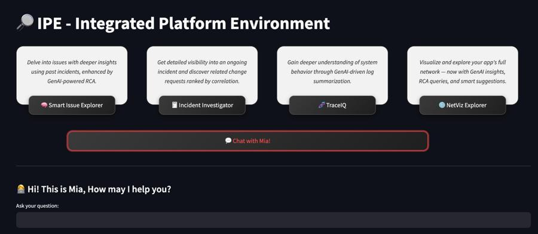
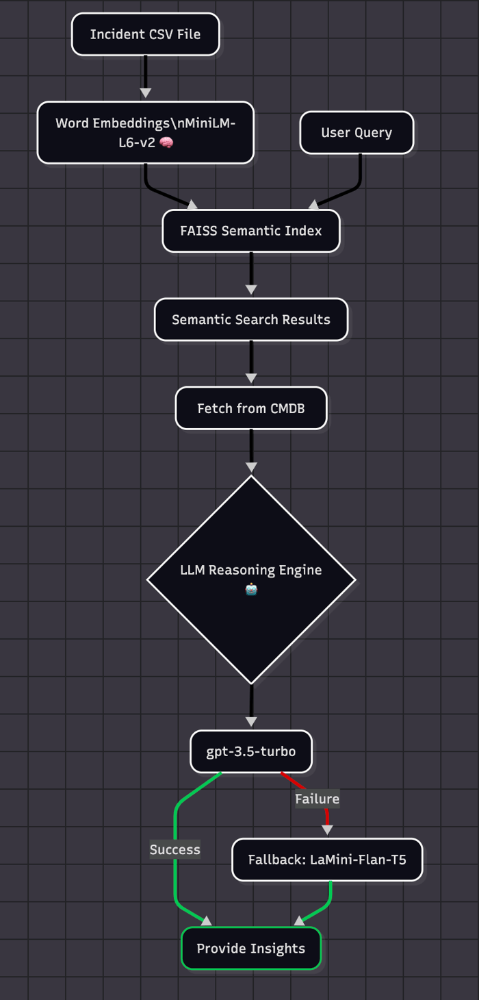

# 🤖 GenAI-Powered Integrated Platform Environment


**Sigma-AI** is a **GenAI-enabled** Integrated Platform Environment (IPE) that empowers platform engineers by reducing context switching across tools. It brings observability, RCA generation, network analysis, and intelligent insights into a unified interface using vector search, CMDB correlations, and LLM-powered workflows.

---

## Table of Contents

1. [User-Interface Overview](#user-interface-overview)
2. [Power of Two Models – Smart Fallback](#-power-of-two-models--smart-fallback)
3. [Incident Similarity Search with Gaussian Distance](#-incident-similarity-search-with-gaussian-distance)
4. [Intelligence Stack](#-intelligence-stack)
5. [Project Structure](#project-structure)
6. [System Architecture](#system-architecture)
7. [LLM & Intelligence Stack](#llm--intelligence-stack)
8. [Installation](#installation)
9. [Configuration](#configuration)
10. [Running the Application](#running-the-application)
11. [Usage](#usage)
12. [Troubleshooting](#troubleshooting)
13. [License](#license)
14. [Acknowledgments](#acknowledgments)

---

## 🖥️ User-Interface Overview



- 🧠 **Smart Issue Explorer**  
  Convert any natural language issue into vector embeddings and search similar incidents. Get RCA and related CRs powered by LLMs. 
    - Converts it into vector embeddings
    - Uses FAISS with Gaussian Distance to find similar past incidents
      - Contextual incident matches
    - Uses GenAI (LLMs) to provide:
      - Relevant RCA suggestions
      - Correlated CRs (Change Requests) based on CI and timing
      - Helpful resolution summaries & Log Summarization. 
  
- 🧾 **Incident Investigator**  
  Enter a specific incident ID to generate contextual RCA, show related CRs, and suggest resolution.  
    - Retrieves historical matches
    - Applies LLM to generate a **Root Cause Analysis (RCA)**
    - Suggests probable causes and next steps
  
- 🧬 **TraceIQ**  
  Feed logs from APIs, analyze them using LLMs, and receive suggestions based on trace ID and log content.  
    - Reads logs from connected log injection APIs
    - Applies LLM to suggest possible fixes
    - Helps platform teams derive meaning from complex logs

- 🌐 **NetViz Explorer**  
  Visualize app-to-CI/API dependencies using CMDB mapping and explore how components are connected.  
    - Builds a **dynamic network diagram** from CMDB data
    - Displays app-to-CI/API relationships
    - Helps teams understand dependency paths and potential breakpoints
    - Have GenAI Capability to suggest, summarize and debug architectural issues. 
  
- 💬 **Agentic Chatbot**  
  Ask questions, explore suggestions, and receive guidance directly through an LLM-powered assistant.
  - Self-help for generalized platform queries
  - Guidance on Sigma-AI usage
  - Fast answers to system and RCA-related questions
  - Direct interaction with knowledge embedded from your incidents, CRs, and CMDB

---

## 🔁 Power of Two Models – Smart Fallback

Sigma-AI intelligently uses:
- ⚡ **Primary**: OpenAI GPT-3.5 for RCA generation
- 🔄 **Fallback**: Hugging Face Mistral 7B when OpenAI quota limits apply

---
## 📊 Sigma-AI Architecture

<p align="center">
  
</p>

---

## 📐 Incident Similarity Search with L2 (Euclidean) Distance

Sigma-AI uses **FAISS** for high-performance similarity search based on **squared Euclidean (L2) distance**. This is used to compare vector embeddings and retrieve semantically similar incidents.

### 📏 L2 (Euclidean) Distance

The standard Euclidean distance between two vectors **x** and **y** is:

$$
\\text{distance} = \\sqrt{(x_1 - y_1)^2 + (x_2 - y_2)^2 + \\cdots + (x_n - y_n)^2}
$$

---


## 🧠 Intelligence Stack

Sigma-AI brings together multiple components to power its intelligence:

- 🔡 **Embedding Model**: all-MiniLM-L6-v2 from SentenceTransformers  
- 🔍 **Vector Search Engine**: FAISS  
- 🧠 **LLMs**:
  - OpenAI GPT-3.5
  - Hugging Face's Mistral 7B
  - LaMini-Flan-T5-783M

---

## 📂 Project Structure
```
.
├── streamlit_app.py
├── app/
│   ├── data_loader.py
│   ├── vector_search.py
│   ├── model_runner.py
│   ├── change_checker.py
│   └── log_checker.py
├── data/
│   ├── incident_data.csv
│   ├── change.csv
│   ├── CMDB_Mapping.csv
│   └── Logs_Lookup.csv
└── requirements.txt

```
---

## System Architecture

User Input (Incident ID or Free Text)
        |
[Embedding Model: all-MiniLM-L6-v2]
        |
   [Vector Embedding]
        |
FAISS Similarity Search (Gaussian Distance)
        |
Retrieve Top-K Similar Incidents
        |
[LLM: GPT / Mistral]
→ RCA Generation   → Resolution Suggestion
        |
CR + Log Correlation (CMDB + Trace ID)


---

## Installation

bash
git clone https://github.com/your-username/sigma-ai.git
cd sigma-ai
pip install -r requirements.txt


---

## Configuration

bash
export OPENAI_API_KEY=your-key


---

## Running the Application

bash
streamlit run streamlit_app.py


---

## Usage

1. Use Smart Issue Explorer to describe symptoms.
2. Use Incident Investigator with an incident ID.
3. Use TraceIQ for log analysis.
4. Use NetViz Explorer for dependency mapping.
5. Use the chatbot for self-help queries.

---

## Troubleshooting

- Ensure OpenAI API key is configured.
- Confirm Hugging Face models are accessible or installed.
- Ensure log injection APIs are operational.

---

## License

MIT License

---

## Acknowledgments

- Hugging Face
- OpenAI
- Streamlit
- FAISS team
                                      
