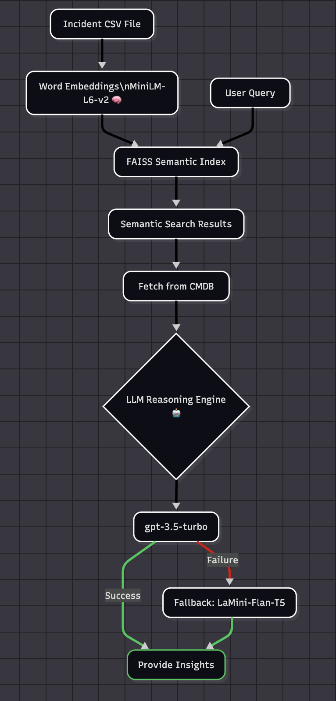

# 🤖 Sigma-AI – GenAI-Powered Integrated Platform Environment

**Sigma-AI** is a **GenAI-enabled** Integrated Platform Environment (IPE) that empowers platform engineers by reducing context switching across tools. It integrates observability, root cause analysis (RCA) generation, network analysis, and intelligent insights into a unified interface using vector search, CMDB correlations, and LLM-powered workflows.

---

## Table of Contents

1. [User Interface Overview](#user-interface-overview)
2. [Power of Two Models – Smart Fallback](#power-of-two-models--smart-fallback)
3. [Incident Similarity Search with L2 (Euclidean) Distance](#incident-similarity-search-with-l2-euclidean-distance)
4. [Intelligence Stack](#intelligence-stack)
5. [Project Structure](#project-structure)
6. [System Architecture](#system-architecture)
7. [Installation](#installation)
8. [Configuration](#configuration)
9. [Running the Application](#running-the-application)
10. [Usage](#usage)
11. [Troubleshooting](#troubleshooting)
12. [License](#license)
13. [Acknowledgments](#acknowledgments)

---

## 🖥️ User Interface Overview

- 🧠 **Smart Issue Explorer**  
  Convert any natural language issue into vector embeddings and search for similar incidents. Get RCA and related change requests (CRs) powered by LLMs.
  - Converts input into vector embeddings.
  - Uses FAISS with Gaussian Distance to find similar past incidents.
  - Provides:
    - Contextual incident matches.
    - Relevant RCA suggestions.
    - Correlated CRs based on configuration items (CIs) and timing.
    - Helpful resolution summaries and log summarization.

- 🧾 **Incident Investigator**  
  Enter a specific incident ID to generate contextual RCA, show related CRs, and suggest resolutions.
  - Retrieves historical matches.
  - Applies LLM to generate a **Root Cause Analysis (RCA)**.
  - Suggests probable causes and next steps.

- 🧬 **TraceIQ**  
  Feed logs from APIs, analyze them using LLMs, and receive suggestions based on trace ID and log content.
  - Reads logs from connected log injection APIs.
  - Applies LLM to suggest possible fixes.
  - Helps platform teams derive meaning from complex logs.

- 🌐 **NetViz Explorer**  
  Visualize app-to-CI/API dependencies using CMDB mapping and explore how components are connected.
  - Builds a **dynamic network diagram** from CMDB data.
  - Displays app-to-CI/API relationships.
  - Helps teams understand dependency paths and potential breakpoints.
  - Includes GenAI capability to suggest, summarize, and debug architectural issues.

- 💬 **Agentic Chatbot**  
  Ask questions, explore suggestions, and receive guidance directly through an LLM-powered assistant.
  - Self-help for generalized platform queries.
  - Guidance on Sigma-AI usage.
  - Fast answers to system and RCA-related questions.
  - Direct interaction with knowledge embedded from your incidents, CRs, and CMDB.

---

## 🔁 Power of Two Models – Smart Fallback

Sigma-AI intelligently uses:
- ⚡ **Primary**: OpenAI GPT-3.5 for RCA generation.
- 🔄 **Fallback**: Hugging Face Mistral 7B when OpenAI quota limits apply.

---

## 📊 Sigma-AI Architecture

  

---

## 📐 Incident Similarity Search with L2 (Euclidean) Distance

Sigma-AI uses **FAISS** for high-performance similarity search based on **squared Euclidean (L2) distance**. This is used to compare vector embeddings and retrieve semantically similar incidents.

### 📏 L2 (Euclidean) Distance

The standard Euclidean distance between two vectors **x** and **y** is:

$$
\text{distance} = \sqrt{(x_1 - y_1)^2 + (x_2 - y_2)^2 + \cdots + (x_n - y_n)^2}
$$

However, **FAISS** returns the **squared distance** to avoid computing the square root, which is faster and sufficient for ranking:

$$
\text{squared\_distance} = \sum_{i=1}^{n}(x_i - y_i)^2
$$

This method ensures efficient and accurate nearest-neighbor search across high-dimensional embeddings.

---

## 🧠 Intelligence Stack

Sigma-AI brings together multiple components to power its intelligence:

- 🔡 **Embedding Model**: `all-MiniLM-L6-v2` from SentenceTransformers.
- 🔍 **Vector Search Engine**: FAISS.
- 🧠 **LLMs**:
  - OpenAI GPT-3.5.
  - Hugging Face's Mistral 7B.
  - `LaMini-Flan-T5-783M`.

---

## 📂 Project Structure

